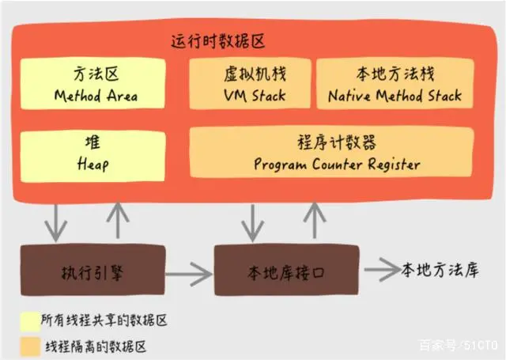

## 《深入理解Java虚拟机（第三版）》

### 1. 运行时数据区域

#### 程序计数器

它是**当前线程**所执行的字节码行号指示器，用来指示**字节码解释器**下一条需要执行的字节码指令，程序中的分支、循环、跳转、异常处理和线程恢复等都依赖这个计数器来完成。

每条线程都需要一个**独立的程序计数器**，各条线程中的计数器互不影响，是**线程私有**的。

它也是**唯一**一个没有规定任何`OutOfMemoryError`的区域。

#### 虚拟机栈

它是**Java方法执行的线程内存模型**。每个方法被执行的时候，Java虚拟机都会同步创建一个栈帧，用于存储局部变量表、操作数栈、动态连接和方法出口等信息。
**每个方法被调用直至执行完毕**的过程，就对应着一个栈帧在虚拟机栈中从入栈到出栈的过程。

**局部变量表**存放了**编译期**可知的各种Java虚拟机基本数据类型、对象的引用（reference类型）和returnAddress类型（指向一条字节码指令的地址）。
这些数据类型在局部变量表中以**局部变量槽**来表示，其中64位的long和double类型会占用两个局部变量槽，其余的只占用一个。
局部变量表所需的内存空间在**编译期间**完成分配，运行期间局部变量表的大小不再改变。

每条线程都有一个虚拟机栈，也是线程私有的，生命周期与线程相同。

如果线程请求的栈帧深度大于虚拟机栈的深度，将抛出`StackOverflowError`异常；
如果Java虚拟机栈的容量可以动态扩展，那么当栈扩展时无法申请到足够的内存则会抛出`OutOfMemoryError`异常（HopSpot的栈容量不支持动态扩展）。

